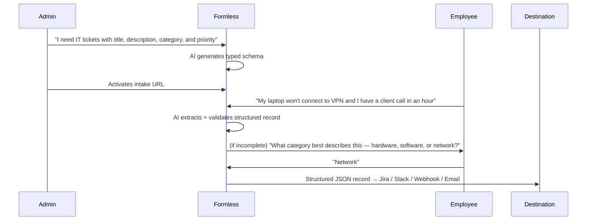
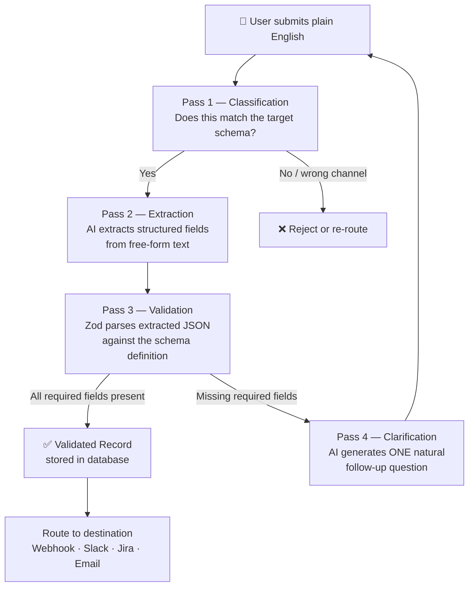

# Formless

> Replace your forms with a conversation.

[](LICENSE)


Formless is an AI-powered intake platform for operations teams that lets employees submit requests, tickets, and reports in **plain English** — no forms, no fields, no training required.

**The idea:** Forms exist because computers couldn't understand intent. LLMs changed that.

---

## How It Works

Formless sits between the humans submitting requests and the systems that process them. An admin defines *what* they need; employees say it however they'd naturally say it; Formless handles the rest.



---

## AI Pipeline

Under the hood, every submission runs through a four-pass pipeline designed to maximize extraction quality and minimize hallucination.



---

## Use Cases

Anywhere humans currently fill out structured forms:

- **IT helpdesk** — *"My monitor is flickering and I have a presentation tomorrow"*
- **HR onboarding intake** — *"I'm starting Monday and need laptop + Slack access"*
- **Procurement requests** — *"Need 3 monitors for the new hires, budget around $400 each"*
- **Incident reports** — *"Production API threw 500s from 2–2:15pm, affecting checkout"*
- **Legal intake** — *"Vendor contract renewal due next month, standard SaaS terms"*
- **Customer support triage** — routed, categorized, and summarized automatically

---

## Architecture

| Layer | Technology |
|-------|-----------|
| Frontend + API | [Next.js 14](https://nextjs.org) (App Router, monolith-first) |
| AI Model | [Groq API](https://groq.com) (`llama-3.3-70b-versatile`) — two-pass classify + extract |
| Structured Output | JSON mode + [Zod](https://zod.dev) runtime validation |
| Database | [Supabase](https://supabase.com) — PostgreSQL + Auth + real-time |
| UI | [Tailwind CSS](https://tailwindcss.com) + [shadcn/ui](https://ui.shadcn.com) |
| Hosting | [Netlify](https://netlify.com) |

---

## Schema Definition

Formless schemas are defined in plain English by admins, then structured by AI. Example output for IT Tickets:

```json
{
  "name": "IT Support Ticket",
  "fields": [
    { "name": "title",           "type": "string", "required": true },
    { "name": "description",     "type": "string", "required": true },
    { "name": "category",        "type": "enum",   "required": true, "values": ["hardware", "software", "network", "access", "other"] },
    { "name": "priority",        "type": "enum",   "required": true, "values": ["low", "medium", "high", "critical"] },
    { "name": "requester",       "type": "string", "required": true },
    { "name": "affected_system", "type": "string", "required": false }
  ]
}
```

---

## Status & Roadmap

| Phase | Status | Focus |
|-------|--------|-------|
| Phase 0–1 | ✅ Complete | Foundation, schema builder, intake engine, clarification loop, auth |
| Phase 2 (partial) | 🔄 In progress | Slack ✅ · Webhook ✅ · Email (next) · Jira (planned) |
| Phase 3 | Planned | Multi-workspace support, analytics, usage billing |

See [`docs/ROADMAP.md`](docs/ROADMAP.md) for the full breakdown.

---

## Docs

- [Brainstorm & Vision](docs/brainstorm.md)
- [Product Requirements](docs/PRD.md)
- [Architecture](docs/ARCHITECTURE.md)
- [Roadmap](docs/ROADMAP.md)

---

## License

[MIT](LICENSE) © 2026 Otoniel Rojas
